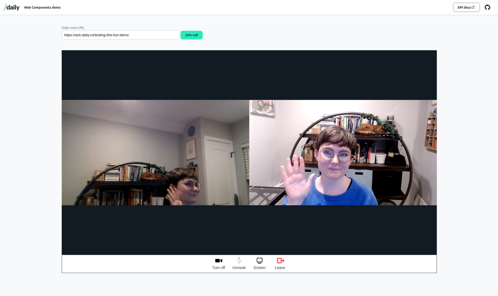

# Daily web components

This demo represents use of Daily's custom [daily-js front end library](https://docs.daily.co/reference/daily-js) and [web components](https://developer.mozilla.org/en-US/docs/Web/Web_Components) to create an interactive video call that can be added to any website or application.

You can check out a live version [here](https://daily-demos.github.io/web-components).

## Requirements

To use this demo, you will first need to [create a Daily account](https://dashboard.daily.co/signup). You will need your Daily API key, which can be found on the [Developers](https://dashboard.daily.co/developers) page, if you want to create new rooms through the demo UI.

To get started with a local deployment, run a server from this repo's directory. You can use something like `python -m SimpleHTTPServer` (run on the command line in the repo's directory) or use the VSCode [Live Server](https://marketplace.visualstudio.com/items?itemName=ritwickdey.LiveServer) extension. See [How do you set up a local testing server?](https://developer.mozilla.org/en-US/docs/Learn/Common_questions/set_up_a_local_testing_server) for more info.

You can use existing Daily rooms in the demo by pasting the room URL into the input field. The room URL should be in this format to be valid: `https://domain-name.daily.co/room-name`, with `daily-domain` changed to your domain, and `room-name` changed to the name of the existing room you would like to use.

This demo uses the following Daily methods:

- [`createCallObject()`](https://docs.daily.co/reference/daily-js/factory-methods/create-call-object#main)
- [`join()`](https://docs.daily.co/reference/daily-js/instance-methods/join#main)
- [`leave()`](https://docs.daily.co/reference/daily-js/instance-methods/leave#main)
- [`setLocalVideo()`](https://docs.daily.co/reference/daily-js/instance-methods/set-local-video#main)
- [`setLocalAudio()`](https://docs.daily.co/reference/daily-js/instance-methods/set-local-audio#main)
- [`startScreenShare()`](https://docs.daily.co/reference/daily-js/instance-methods/start-screen-share#main)
- [`stopScreenShare()`](https://docs.daily.co/reference/daily-js/instance-methods/stop-screen-share#main)

This demo uses the following Daily events:

- [`error`](https://docs.daily.co/reference/daily-js/events/meeting-events#error)
- [`participant-left`](https://docs.daily.co/reference/daily-js/events/participant-events#participant-left)
- [`track-started`](https://docs.daily.co/reference/daily-js/events/participant-events#track-started)
